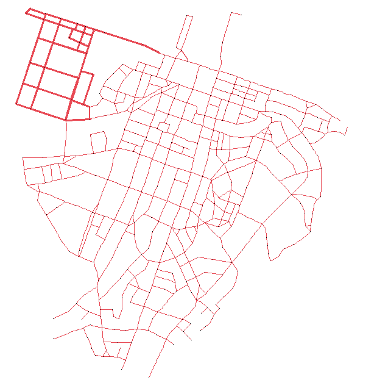
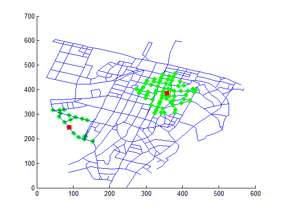

# Walking Catchments in the Auckland CBD
This is a personal project done with MATLAB in 2016, while I was at university. I've loaded it to GitHub purely for the nostalgia!

This readme was written retrospectively in 2021. I didn't run any of the code (although presumably it would run in Octave) so there are no warranties that it's in a functioning state.

# Background
A walking catchment is the set of places that you can walk to in, say, 5 minutes. Larger walking catchments allow for more flexible routing through the pedestrian network and access to more premises/people per minute's walk. Denser areas of a pedestrian network mean larger walking catchments and therefore more things within easy reach. By contrast, points in a street network with fewer nearby intersections and links necessarily have smaller walking catchments and therefore afford fewer opportunities.

This project investigated the variability in the size of walking catchments across Auckland's CBD (Central Business District).

# Workflow
From what I can tell, the process was:

* `maplayer.bmp` was generated by hand (screengrabs from Google Maps)
* A raster layer of the pedestrian network `cbdped.bmp` was drawn over the top by hand

* This was read in by `nodenumbers.m`, which generated an index and coordinates for each node
* This was plotted out into `Map of node labels.png` and written out to `Sheet2` of `adjacencylist.xlsx`

* (I think) `Sheet1` of `adjacencylist.xlsx` was generated by hand (for 603 nodes!!)
* The adjacency list somehow made its way into the MATLAB environment (point-and-click import interface?)
* `allspath.m` implements an all-pairs-shortest-path algorithm - taken from https://uk.mathworks.com/matlabcentral/fileexchange/8808-all-pairs-shortest-path-graph-solver
* `mapimgread.m` read in the adjacency list, calculated all-pairs-shortest-paths, and plotted walking catchments for a given node set and distance threshold, like in `example_catchment_output.bmp`

# Results
I wrote up a summary at the time in `Walking Catchments 1-pager.docx`.

This project illustrated the point that some parts of the Auckland CBD pedestrian network are better connected than others.

# References
The writeup mentions several academic papers but doesn't cite them properly:

* Peponis, J., Bafna, S., & Zhang, Z. (2008). The connectivity of streets: reach and directional distance. Environment and Planning B: Planning and Design, 35(5), 881-901.
* Gil, J. (2015, July). Examining “edge effects”: Sensitivity of spatial network centrality analysis to boundary conditions. In Proceedings of the 10th International Space Syntax Symposium (p. 147).
* Ellis, G., Hunter, R., Tully, M. A., Donnelly, M., Kelleher, L., & Kee, F. (2016). Connectivity and physical activity: using footpath networks to measure the walkability of built environments. Environment and Planning B: Planning and Design, 43(1), 130-151.
* Finnis, K. K., & Walton, D. (2007, February). Field observations of factors influencing walking speeds. In Proceedings of the 2nd International Conference Proceedings on Sustainability Engineering and Science, Auckland, New Zealand (pp. 21-23).
* Özbil, A., Yeşiltepe, D., & Argin, G. (2015). Modeling walkability: The effects of street design, street-network configuration and land-use on pedestrian movement. A| Z ITU Journal of the Faculty of Architecture, 12(3), 189-207.

# Retrospective
I found working files for performing similar analysis over a larger part of Auckland, and also Malé in the Maldives (which has a fascinating street network; it's tiny but supports a population of over 200,000). As should be evident, this approach didn't scale to any degree and so those were never completed. I remember having fun on this project and was delighted to find the files in a semi-coherent form!
